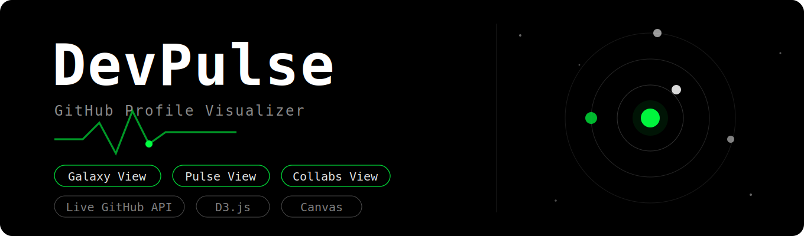

# 🚀 DevPulse: Full-Stack Developer Analytics



DevPulse is an advanced, high-performance GitHub profile visualizer and Global Leaderboard. Built with a sleek "Matrix Hacker" terminal aesthetic, it goes beyond the standard GitHub contribution graph by transforming raw developer data into immersive, interactive data visualizations using D3.js and the HTML5 Canvas API.

## ✨ Features

- **Global Leaderboard (MERN Stack):** Automatically tracks and ranks every developer searched on the platform based on their total commits, storing the data securely in a MongoDB database.
- **The Galaxy View:** A custom HTML5 Canvas animation that maps a user's repositories as orbiting planets in a solar system, scaled by size and activity.
- **The Pulse View:** Advanced D3.js data visualizations featuring a 52-week contribution heatmap and a real-time radial "Commit Clock" mapping activity by hour.
- **The Collabs View:** A D3 Force-Directed Graph that visualizes a user's network by crawling their repositories and linking them with their recent co-contributors.
- **Live GitHub Integration:** Seamlessly fetches real-time data using the GitHub REST API and handles complex data aggregations and pagination under the hood.

## 🛠️ Architecture: Feature-Sliced Design (FSD) Monorepo

This project is structured as a full-stack Monorepo utilizing the enterprise-grade Feature-Sliced Design (FSD) architecture for the frontend client.

- **Frontend:** React 18, Vite, Tailwind CSS, D3.js
- **Backend:** Node.js, Express.js
- **Database:** MongoDB
- **Data Source:** GitHub REST & GraphQL APIs

## 🚀 Running Locally

To run the DevPulse MERN stack on your local machine, follow these steps:

### 1. Setup GitHub Personal Access Token (Frontend)
1. Generate a Personal Access Token on GitHub (no specific scopes required).
2. Create a `.env.local` file inside the `frontend/` directory.
3. Add your token: `VITE_GITHUB_TOKEN=your_token_here`

### 2. Setup MongoDB (Backend)
1. Ensure MongoDB is installed locally (or you have an Atlas cluster URI).
2. Create a `.env` file inside the `backend/` directory.
3. Add your environment variables:
```env
PORT=5000
MONGO_URI=mongodb://127.0.0.1:27017/devpulse
```

### 3. Start the Backend Server
```bash
cd backend
npm install
node index.js
```
*The server will run on http://localhost:5000*

### 4. Start the Frontend Client
Open a **second terminal window**:
```bash
cd frontend
npm install
npm run dev
```
Navigate to `http://localhost:5173` in your browser.

## 📝 License

